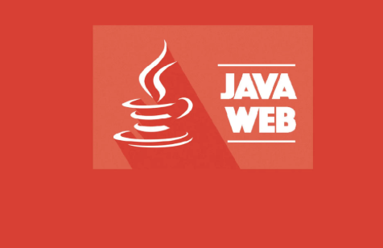
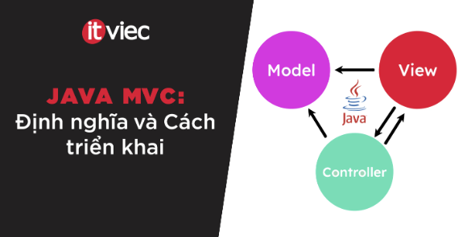

# Hsdemy Web

Nền tảng học trực tuyến (e-learning) xây dựng bằng **Spring Boot**, gồm giao diện người học, quản trị khóa học, giỏ hàng, thanh toán **VNPay** (sandbox) và tích hợp chatbot tư vấn khóa học qua **OpenAI** (tùy chọn).


## Xem trước (preview)

Ảnh minh họa một số **thumbnail khóa học** có trong dự án (tài nguyên tĩnh dưới `src/main/webapp/resources/images/course/`):

| | | |
|:---:|:---:|:---:|
|  |  |  |
| Java | Java MVC | Coding interview |

> **Gợi ý:** Sau khi chạy ứng dụng, bạn có thể chụp màn hình trang chủ (`/`), danh sách khóa (`/courses`), lộ trình (`/learning-path`) và thay thế hoặc bổ sung ảnh vào thư mục `docs/preview/` để README phản ánh đúng giao diện thực tế.

## Tính năng chính

- **Người dùng:** đăng ký, đăng nhập, hồ sơ, lịch sử mua hàng, thông báo, giỏ hàng.
- **Khóa học:** xem chi tiết, học theo chương/bài, lộ trình học tập, tìm kiếm gợi ý.
- **Thanh toán:** checkout, tích hợp VNPay (cấu hình qua `application.properties` / biến môi trường).
- **Quản trị:** dashboard, khóa học, chương/bài, danh mục, đơn hàng, phân tích doanh thu / đơn / danh mục.
- **Chatbot tư vấn:** API `/api/chat/course-advisor` (bật/tắt và API key qua cấu hình OpenAI).

## Công nghệ

| Thành phần | Công nghệ |
|------------|-----------|
| Runtime | Java **17** |
| Framework | Spring Boot **3.2.2** (Web, Data JPA, Security, Validation, Actuator) |
| View | JSP + JSTL (Tomcat Embed Jasper) |
| Cơ sở dữ liệu | **MySQL** |
| Build | **Maven** |

## Yêu cầu

- JDK 17+
- Maven 3.8+
- MySQL (mặc định database `hstudemyweb` theo cấu hình mẫu)

## Cài đặt & chạy nhanh

1. **Tạo database MySQL** (ví dụ tên `hstudemyweb`) và cấp quyền cho user ứng dụng.

2. **Cấu hình kết nối** trong `src/main/resources/application.properties`:
   - `spring.datasource.url`, `username`, `password`
   - Hoặc dùng biến môi trường nếu bạn đã chỉnh `application.properties` cho phù hợp (ví dụ `MYSQL_HOST` nếu có cấu hình tương ứng).

3. **Biên dịch và chạy:**

   ```bash
   mvn spring-boot:run
   ```

4. Mở trình duyệt: [http://localhost:8080](http://localhost:8080) (cổng mặc định Spring Boot nếu chưa đổi).

## Cấu hình tùy chọn

- **OpenAI (chatbot):** trong `application.properties` có `openai.chat.enabled`, `openai.api-key`, `openai.model`, `openai.base-url`. Có thể ghi đè bằng biến môi trường như `OPENAI_API_KEY`, `OPENAI_CHAT_ENABLED`, v.v.
- **VNPay:** cấu hình `vnpay.*` và `vnpay.returnUrl` phải khớp URL ứng dụng khi triển khai thật. **Không** đưa secret production lên kho mã công khai; dùng biến môi trường hoặc cấu hình riêng ngoài Git.

## Cấu trúc thư mục (rút gọn)

```
src/main/java/Hsdemy/vn/HsdemyWeb/   # Mã nguồn Java (controller, service, entity, …)
src/main/webapp/WEB-INF/view/        # JSP (client / admin)
src/main/webapp/resources/           # CSS, JS, hình ảnh tĩnh
src/main/resources/application.properties
docs/preview/                        # Ảnh preview cho README
```

## Kiểm thử

```bash
mvn test
```

---

Dự án: **HsdemyWeb** · Nhóm `Hsdemy.vn`
